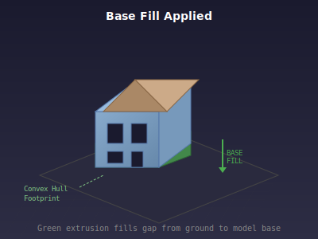
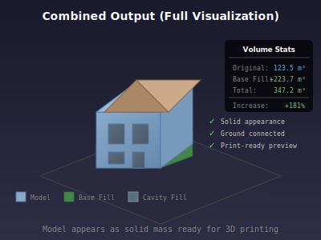

# IFC Mesh Preview POC - Implementation Guide

## Overview

This POC demonstrates client-side visualization techniques for "filling" IFC building models using Three.js. The goal is to show approximate solid previews without heavy server-side computation.

### Key Features

1. **Base/Ground Fill** - Fills the gap between a floating model and the ground plane
2. **Cavity Fill Illusion** - Makes internal building spaces appear solid using material tricks
3. **Volume Calculation** - Computes volumes to verify the fill is working

---

## Architecture

```
┌─────────────────────────────────────────────────────────────┐
│                        React App                            │
├─────────────────────────────────────────────────────────────┤
│  ┌──────────────┐    ┌──────────────┐    ┌──────────────┐  │
│  │   App.jsx    │────│  IFCViewer   │────│   Three.js   │  │
│  │  (UI/Stats)  │    │  (3D Scene)  │    │   (WebGL)    │  │
│  └──────────────┘    └──────────────┘    └──────────────┘  │
│                             │                               │
│         ┌───────────────────┼───────────────────┐          │
│         ▼                   ▼                   ▼          │
│  ┌──────────────┐    ┌──────────────┐    ┌──────────────┐  │
│  │  ifcLoader   │    │   baseFill   │    │  cavityFill  │  │
│  │  (web-ifc)   │    │ (extrusion)  │    │  (BackSide)  │  │
│  └──────────────┘    └──────────────┘    └──────────────┘  │
└─────────────────────────────────────────────────────────────┘
```

---

## Visual Output Examples

> **Note:** To capture real screenshots of the running application, see the [Capturing Screenshots](#capturing-screenshots) section below. The diagrams in this section illustrate the concepts; run the app locally to see real WebGL output.

### Live Screenshots

To generate screenshots from the running application:

```bash
# Start the dev server
npm run dev

# Open http://localhost:5173 in your browser
# Use the orbit controls to rotate and explore the model
# Take screenshots using your browser or OS screenshot tool
```

**Expected output when running locally:**

| View | Description |
|------|-------------|
| Initial Load | Building model centered, floating above grid |
| Base Fill (green) | Semi-transparent green extrusion from ground to model base |
| Cavity Fill | Dark interior visible through windows/doors |
| Stats Panel | Volume calculations displayed in top-left corner |

---

### Concept Diagrams

### 1. Original Model (No Fill)

The IFC model loaded without any filling applied:


**Characteristics:**
- Model may float above ground (visible gap)
- Internal spaces are hollow (visible through windows/doors)
- Only front-facing surfaces rendered

### 2. Base Fill Applied

Green semi-transparent geometry fills the gap between model and ground:



**Characteristics:**
- Convex hull of footprint extruded from Y=0 to model's minY
- Semi-transparent green material (opacity: 0.6)
- Shows printable base volume

### 3. Cavity Fill Applied

BackSide material makes interiors appear solid:


**Characteristics:**
- Clone of model rendered with THREE.BackSide
- Darker material visible through openings
- Creates illusion of solid interior

### 4. Combined Output

Full visualization with both fills:



**Characteristics:**
- Building appears as solid mass
- Base extends to ground
- Ready for 3D printing preview

---

## Implementation Details

### 1. IFC Loading (`src/utils/ifcLoader.js`)

We use `web-ifc` directly (not `web-ifc-three`) for better compatibility:

```javascript
// Initialize the IFC API
const ifcAPI = new WebIFC.IfcAPI()
await ifcAPI.Init()

// Load model and stream meshes
const modelID = ifcAPI.OpenModel(data)
ifcAPI.StreamAllMeshes(modelID, (mesh) => {
  // Process each mesh geometry
  const placedGeometries = mesh.geometries
  for (let i = 0; i < placedGeometries.size(); i++) {
    const geometry = createThreeGeometry(placedGeometry)
    group.add(new THREE.Mesh(geometry, material))
  }
})
```

**Key Points:**
- WASM files must be served from `/wasm/` directory
- Vertices are packed as [x, y, z, nx, ny, nz] (position + normal)
- Transformation matrices are applied per-geometry

### 2. Base Fill Algorithm (`src/utils/baseFill.js`)

#### Step 1: Project Vertices to XZ Plane

```javascript
// Collect all vertices projected onto ground
const projectedPoints = []
model.traverse((child) => {
  if (child.isMesh) {
    const position = child.geometry.getAttribute('position')
    for (let i = 0; i < position.count; i++) {
      const vertex = new THREE.Vector3(...)
      vertex.applyMatrix4(child.matrixWorld)
      // Project to 2D (ignore Y)
      projectedPoints.push(new THREE.Vector2(vertex.x, vertex.z))
    }
  }
})
```

#### Step 2: Compute Convex Hull (Graham Scan)

```javascript
function computeConvexHull2D(points) {
  // Find lowest point
  let start = findLowestPoint(points)

  // Sort by polar angle
  const sorted = sortByAngle(points, start)

  // Build hull using cross product test
  const hull = [start]
  for (const point of sorted) {
    while (hull.length > 1 && crossProduct(...) <= 0) {
      hull.pop()
    }
    hull.push(point)
  }
  return hull
}
```

#### Step 3: Extrude to Ground

```javascript
// Create shape from hull
const shape = new THREE.Shape()
shape.moveTo(hull[0].x, hull[0].y)
for (const point of hull) {
  shape.lineTo(point.x, point.y)
}

// Extrude from ground to model
const extrudeSettings = {
  depth: bbox.min.y,  // Fill height
  bevelEnabled: false
}
const geometry = new THREE.ExtrudeGeometry(shape, extrudeSettings)
geometry.rotateX(-Math.PI / 2)  // Orient upward
```

### 3. Cavity Fill (`src/utils/cavityFill.js`)

Simple but effective technique:

```javascript
function createCavityFill(model) {
  const cavityGroup = new THREE.Group()

  model.traverse((child) => {
    if (child.isMesh) {
      const clonedGeometry = child.geometry.clone()

      // Key: render back faces only
      const cavityMaterial = new THREE.MeshStandardMaterial({
        color: 0x5d6d7e,
        side: THREE.BackSide,  // <-- This is the trick
        transparent: true,
        opacity: 0.85
      })

      const cavityMesh = new THREE.Mesh(clonedGeometry, cavityMaterial)
      cavityMesh.applyMatrix4(child.matrixWorld)
      cavityGroup.add(cavityMesh)
    }
  })

  return cavityGroup
}
```

**Why This Works:**
- Normal rendering shows front faces (exterior)
- BackSide shows back faces (interior surfaces)
- Combined, they create the illusion of a solid object

### 4. Volume Calculation (`src/utils/volumeCalculator.js`)

Uses the signed tetrahedron method:

```javascript
function calculateMeshVolume(mesh) {
  let volume = 0
  const position = mesh.geometry.getAttribute('position')
  const index = mesh.geometry.getIndex()

  // For each triangle
  for (let i = 0; i < index.count; i += 3) {
    const v0 = getVertex(i)
    const v1 = getVertex(i + 1)
    const v2 = getVertex(i + 2)

    // Signed volume of tetrahedron with origin
    // V = (1/6) * v0 · (v1 × v2)
    const cross = new THREE.Vector3().crossVectors(v1, v2)
    volume += v0.dot(cross) / 6.0
  }

  return Math.abs(volume)
}
```

---

## Configuration Options

### Demo Mode

When a model sits at or below ground, the viewer automatically raises it:

```javascript
// In IFCViewer.jsx
const DEMO_RAISE_HEIGHT = 2.0  // meters

if (originalMinY <= 0.01) {
  demoRaise = DEMO_RAISE_HEIGHT - originalMinY
  ifcModel.position.y += demoRaise
}
```

### Customizing Materials

```javascript
// Main model material
new THREE.MeshStandardMaterial({
  color: 0x88aacc,      // Light blue-gray
  roughness: 0.5,
  metalness: 0.1,
  transparent: true,
  opacity: 0.9
})

// Base fill material
new THREE.MeshStandardMaterial({
  color: 0x4caf50,      // Green
  transparent: true,
  opacity: 0.6
})

// Cavity fill material
new THREE.MeshStandardMaterial({
  color: 0x5d6d7e,      // Dark gray-blue
  side: THREE.BackSide,
  transparent: true,
  opacity: 0.85
})
```

---

## Testing

### Run All Tests

```bash
npm test
```

### Core Tests (`test/test-core.js`)

- Volume calculation accuracy (2x2x2 cube = 8m³)
- Convex hull algorithm (excludes interior points)
- Polygon area calculation (10x10 square = 100m²)
- File existence checks

### Integration Test (`test/test-ifc-integration.js`)

- Loads actual IFC file with web-ifc
- Verifies mesh extraction (208 meshes, 57K vertices)
- Tests volume calculation pipeline
- Validates base fill computation

---

## Performance Considerations

| Model Size | Vertices | Load Time | Fill Computation |
|------------|----------|-----------|------------------|
| Small      | <10K     | <1s       | ~50ms            |
| Medium     | 10-100K  | 1-3s      | ~200ms           |
| Large      | 100K+    | 3-10s     | ~500ms           |

### Optimization Tips

1. **Use Web Workers** for large models
2. **Simplify convex hull** by sampling vertices
3. **LOD (Level of Detail)** for distant views
4. **Instanced rendering** for repeated elements

---

## Limitations

1. **Convex Hull Only** - Base fill doesn't handle L-shaped or courtyard footprints accurately
2. **Visual Trick** - Cavity fill is an illusion, not true solid geometry
3. **No Boolean Operations** - Actual solid infill would require CSG operations
4. **IFC 4 Focused** - Some IFC 2x3 features may not render correctly

---

## Future Improvements

1. **Concave Hull** - Better footprint for complex shapes
2. **Voxelization** - True cavity filling with 3D grid
3. **Export to STL** - Generate printable mesh
4. **Toggleable Layers** - Show/hide fill components
5. **Multiple File Support** - Compare before/after

---

## Quick Start

```bash
# Install dependencies
npm install

# Start development server
npm run dev

# Run tests
npm test

# Build for production
npm run build
```

Open http://localhost:5173 to view the application.

---

## Capturing Screenshots

To document your implementation or share results, capture screenshots of the running application:

### Manual Screenshot Capture

1. **Start the application:**
   ```bash
   npm run dev
   ```

2. **Open in browser:** Navigate to http://localhost:5173

3. **Wait for loading:** The model will load and display with fills applied

4. **Capture different views:**
   - **Default view** - Initial camera position showing full model
   - **Rotated view** - Click and drag to orbit around the model
   - **Side view** - Rotate to see the green base fill clearly
   - **Top-down view** - Look down to see footprint shape
   - **Zoomed view** - Scroll to zoom in on details

5. **Screenshot the stats panel:** The info panel shows volume calculations

### Recommended Screenshots

| Screenshot | Description | What to Look For |
|------------|-------------|------------------|
| `full-view.png` | Initial load, isometric | Building + green base + grid |
| `side-view.png` | Side angle | Clear view of green base fill height |
| `front-view.png` | Front facade | Windows showing dark cavity fill |
| `top-view.png` | Birds-eye view | Footprint shape and coverage |
| `stats-panel.png` | Info panel | Volume numbers and stats |
| `zoomed-detail.png` | Close-up | Material details and fill edges |

### Expected Visual Results

When running the application, you should see:

1. **Blue-gray building model** (semi-transparent, opacity 0.9)
2. **Green base fill** (semi-transparent, extending from ground to model base)
3. **Dark gray interior** (visible through windows/doors from BackSide material)
4. **Grid ground plane** (dark gray with grid lines)
5. **Stats panel** (top-left corner with volume calculations)
6. **"Demo Mode" indicator** (if model was raised for demonstration)

---

## File Structure

```
Mesh-preview-poc/
├── public/
│   ├── ifc/
│   │   ├── sample.ifc      # Sample house model
│   │   └── duplex.ifc      # Duplex building
│   └── wasm/
│       ├── web-ifc.wasm
│       └── web-ifc-mt.wasm
├── src/
│   ├── components/
│   │   └── IFCViewer.jsx   # Main 3D viewer
│   ├── utils/
│   │   ├── ifcLoader.js    # IFC file loader
│   │   ├── baseFill.js     # Ground fill algorithm
│   │   ├── cavityFill.js   # BackSide material fill
│   │   └── volumeCalculator.js
│   ├── App.jsx             # UI and stats panel
│   ├── main.jsx            # Entry point
│   └── index.css           # Styles
├── test/
│   ├── test-core.js        # Unit tests
│   └── test-ifc-integration.js
├── docs/
│   ├── IMPLEMENTATION_GUIDE.md
│   └── images/             # Diagrams
└── package.json
```
